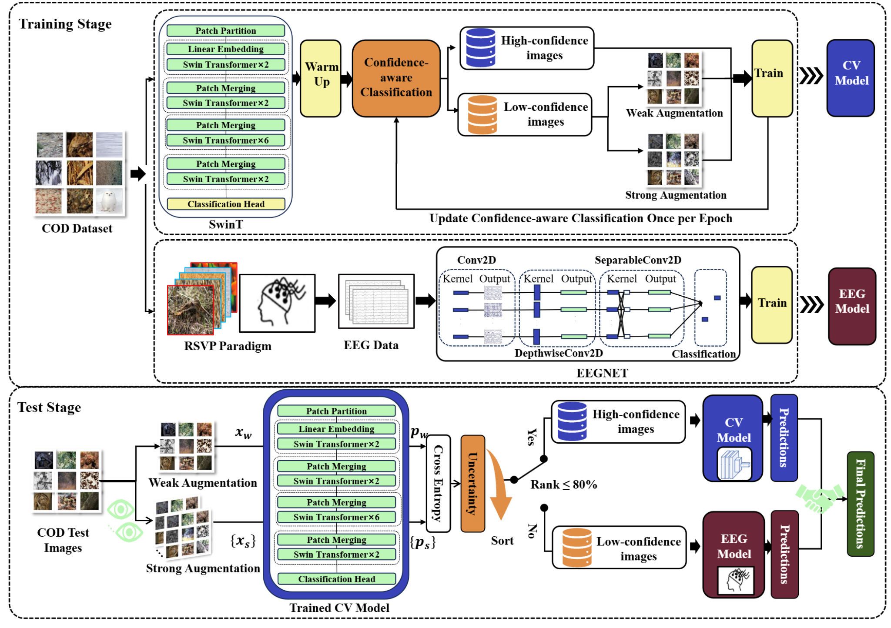

# Uncertainty-aware-human-machine-collaboration-in-camouflaged-object-identification

[查看存档](https://example.com/archive-link)

## Quick Start

git@github.com:ziyuey/Uncertainty-aware-human-machine-collaboration-in-camouflaged-object-identification.git

## Datasets

Our dataset is generated based on [CAMO](https://drive.google.com/open?id=1h-OqZdwkuPhBvGcVAwmh0f1NGqlH_4B6), with the primary distinction being the creation of corresponding background images. Subsequently, we will upload our image dataset along with the associated EEG data.

## Training and Evaluation

## Results

## Reference
